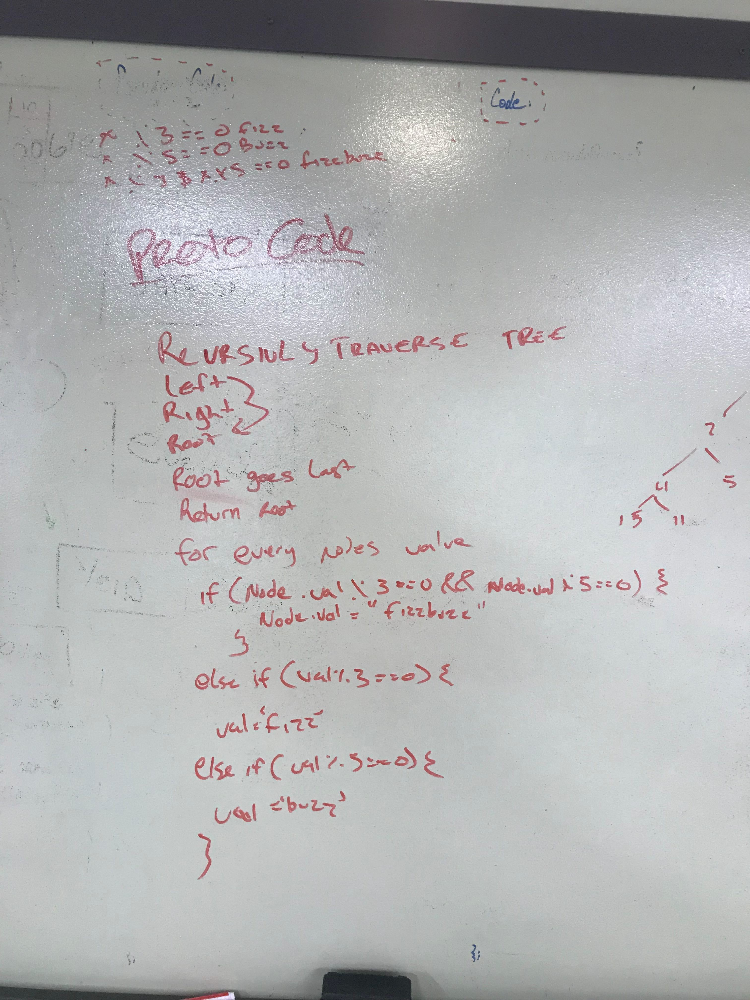

# FizzBuzz Tree
## Challenges
Pretty straight forward. just check/change values as I travers a tree;

 ## Approach & Efficiency
Time is O(n) I Iterate through every node in the worst case.
Space  is 0(1) I don't allocate extra memory beyond changing values.
 ## Solution
 <!-- Embedded whiteboard image -->

