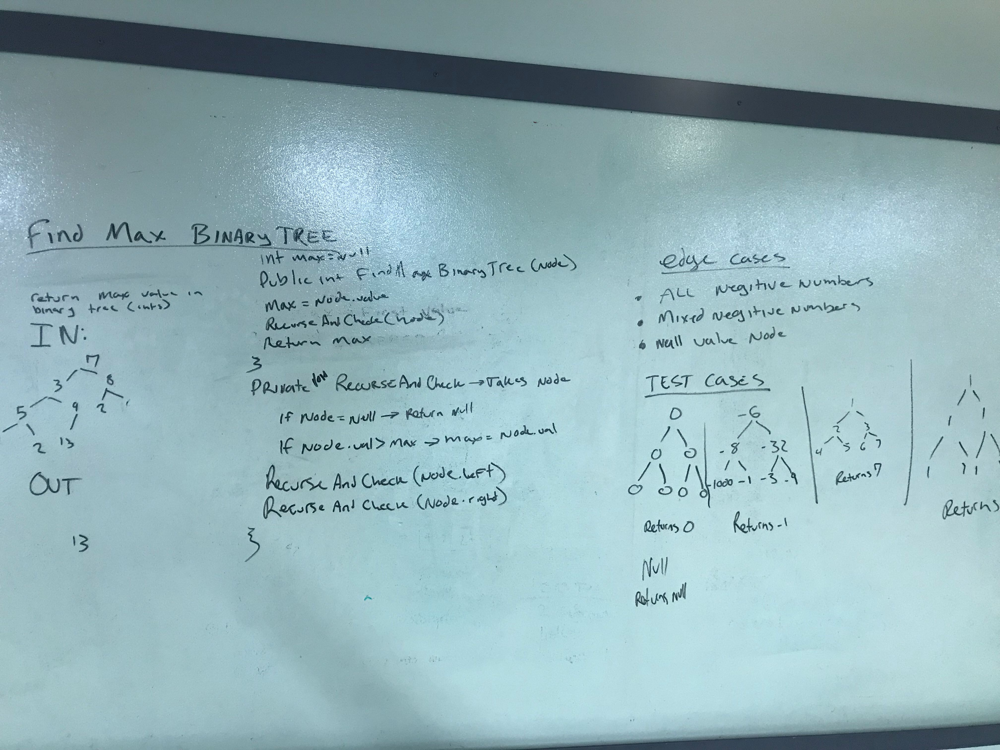

# Trees
Write a tree class as well as a binary search tree
## Challenge
#### preOrder

###### Returns array in preorder.
* Time: O(n)
* Space O(n)

#### inOrder

###### Returns array in inOrder.
* Time: O(n)
* Space O(n)

#### postOrder

###### Returns array in postOrder.
* Time: O(n)
* Space O(n)

## Binary Search Tree
#### add
* Time: O(N log N)
* Space O(1) (you can only add 1 item at a time)

#### contains
* Time: O(n log n)
* Space O(1)

## FindMaximumBinaryTree
Time O(n)
    We recurse through every node(once) and check its value.
SpaceO(n)
    We take up space(n) on the stack.

####

