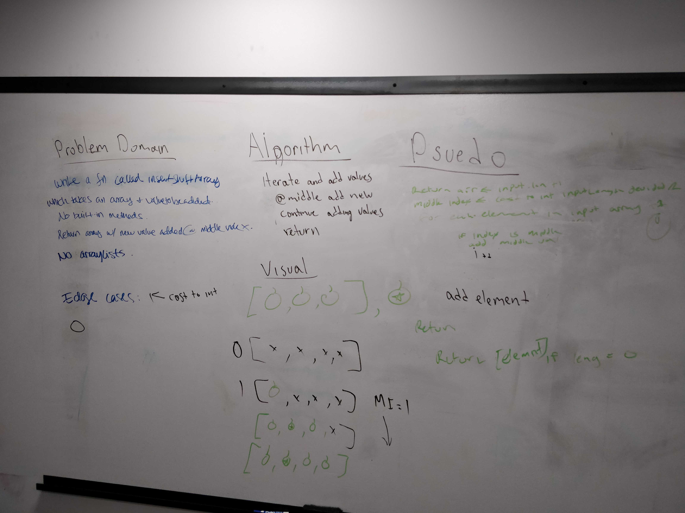

# Array Shift
Insert a item into the middle of an array.

## Challenge Description
Insert the a
## Approach & Efficiency
Create a new return array with the new value inserted in the middle. Iterate over the array and insert the new value.
* Space: N
* Time: N
## Solution

