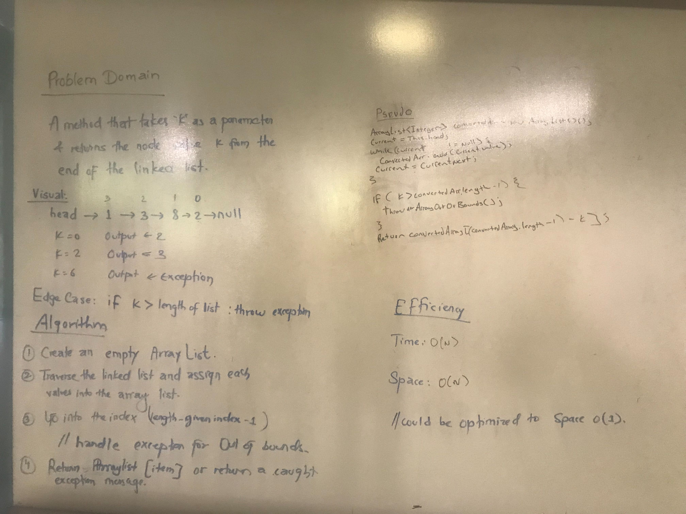

# Linked List Day 2
Inserting items into a linked list

## Challenge Description
Implement different inserts and appends

## Approach & Efficiency
Everything is O(n) time and O(1) space
## Solution

Jakie, Neu, Roman, Steven 

# Linked List Day 3:

### kthFromEnd

## Challenge Description
Implement a return from index but  from the end of the list
## Approach & Efficiency
Time is n(potentially n2 if the arraylist runs out of space and needs to reallocate/copy again), space is n
## Solution
TL;DR create an array

Steve and Manish
